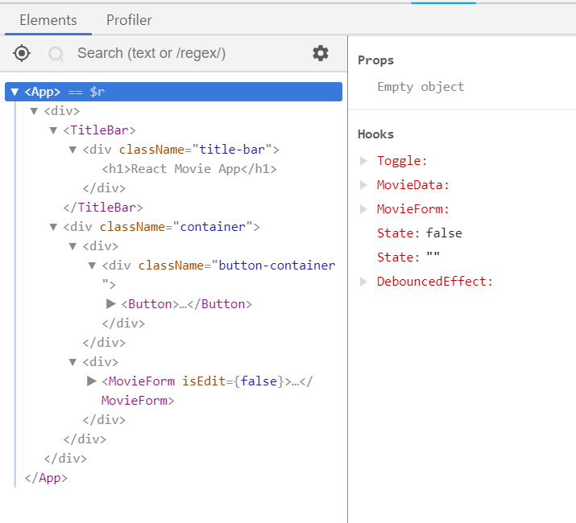

# Hooks

Our current application is too simple, as it's just rendering a list of movies. An actual application is usually more dynamic, e.g.:

- hide some information by default to declutter your page, but allow user click to show more
- loading data from backend api, and showing loading indicator while waiting for response

We will do that by using React Hooks

## Use React States to track UI states e.g. show/hide

Let's assume the design of our app is to display "React Movie App" title and a "Show Movies" button only by default. When user clicks the button, the movies will be shown.

To achieve that, let's modify our `App` component to:

```jsx
...
import { Button } from './components/button';
...

class App extends React.Component {
  state = {
    moviesShown: false
  };

  showMovies = () => {
    this.setState({
      moviesShown: true
    });
  };

  render() {
    let movies;

    if (this.state.moviesShown) {
      movies = (
        <React.Fragment>
          <Movie name="Aquaman" releaseDate="2018-12-07" />
          <Movie name="Bumblebee" releaseDate="2018-12-15" />
          <Movie
            name="Fantastic Beasts: The Crimes of Grindelwald"
            releaseDate="2018-11-14"
          />
        </React.Fragment>
      );
    }

    return (
      <div>
        <TitleBar>
          <h1>React Movie App</h1>
        </TitleBar>
        <div className="button-container">
          <Button onClick={this.showMovies}>
            Show Movies
          </Button>
        </div>
        {movies}
      </div>
    );
  }
}
```

- We initial state for our `App` component with `state = { moviesShown: false }`. Note that I've told you previously that class component is more powerful, and state is one of the functionality that only available for class component (at least for now).
- React state should always be a plain Object, while the value of the properties it totally up to you.
- We declare a `showMovies` methods, which will call `this.setState`. `setState` is a method that is available to all React class component (the component inherit this method via `extends React.Component`), and it's only way for you to update states. If you update state directly (`this.state.showMovies = true`), React will not be notified that the state has been change and thus will not re-render your component, then what is displayed will be incorrect.
- When we call `setState`, React will merge the object we provide it with its current state, then it will rerender the component.
- Note that `showMovies` method is declared with arrow-function syntax. This is because `this` is dynamic in Javascript, and arrow-function will make sure `this` within the method always refer to our component. If this doesn't make sense to you, it is fine, just make sure custom methods you declare in your React component should always use arrow function syntax.
- In the `render` method, we renders `Button` element, which will call `showMovies` method when it is clicked.
- Besides, we declare `movies` variable in `render` method, which be a list of movies if `this.state.moviesShown` is true. `React.Fragment` is a container that renders nothing but allows you to wrap a list of React elements.

Before we proceed, there is some cleanup that I want to suggest:

1. Get rid of `movies` variable and just inline it with `&&` expression.
1. You can replace `React.Fragment` with `<>`, a shorthand for `React.Fragment`. I prefer this way, as this expresses what `React.Fragment` really is &mdash; an empty container.

The `App` component `render` should be as below now:

```jsx
class App extends React.Component {
  ...
  render() {
    return (
      <div>
        <TitleBar>
          <h1>React Movie App</h1>
        </TitleBar>
        <div className="button-container">
          <Button onClick={this.showMovies}>
            Show Movies
          </Button>
        </div>
        {this.state.moviesShown && (
          <>
            <Movie name="Aquaman" releaseDate="2018-12-07" />
            <Movie name="Bumblebee" releaseDate="2018-12-15" />
            <Movie name="Fantastic Beasts: The Crimes of Grindelwald" releaseDate="2018-11-14" />
          </>
        )}
      </div>
    );
  }
}
```

## React DevTools

Before proceed further, let me introduce you to the must-have debugging tools for React developers &mdash; React DevTools. [React DevTools][react-devtools] is a browser extensions maintained by React core team to help you inspect your React components. Once installed, it will add a new tab in your browser Devtools with title "React", which you can used to inspect your React component props and states.



<hr >

## :pencil: Do It: enhance App

1. Install React DevTools.
1. Modify your `App` component to show movies only when clicked as described above.
1. Verify that the application works as expected.

> [:octocat: `1d524846f4f2129fc57742c77b8a4c6108a1ab0e`](https://github.com/malcolm-kee/react-movie-app-v2/commit/1d524846f4f2129fc57742c77b8a4c6108a1ab0e)

<hr >

## More on setState

Our current hide-show functionality only allow us to show, but we can't hide it after that. Let's enhance it.

Modify `App` to be following:

```jsx
class App extends React.Component {
  state = {
    moviesShown: false
  };

  toggleMovies = () => {
    this.setState(prevState => ({
      moviesShown: !prevState.moviesShown
    }));
  };

  render() {
    return (
      <div>
        <TitleBar>
          <h1>React Movie App</h1>
        </TitleBar>
        <div className="button-container">
          <Button onClick={this.toggleMovies}>
            {this.state.moviesShown ? 'Hide' : 'Show'} Movies
          </Button>
        </div>
        {this.state.moviesShown && (
          <>
            <Movie name="Aquaman" releaseDate="2018-12-07" />
            <Movie name="Bumblebee" releaseDate="2018-12-15" />
            <Movie
              name="Fantastic Beasts: The Crimes of Grindelwald"
              releaseDate="2018-11-14"
            />
          </>
        )}
      </div>
    );
  }
}
```

- Button content has been enhanced to show different text based on the state. As explained previously, we need `{}` to code JS expression, else it would be treated as string.
- `showMovies` method is renamed to `toggleMovies` and its content changed. Now the parameters to `setState` is no longer an object but a function. This is because [React may batch multiple `setState` calls into a single update for performance][react-docs-batch-update]. Therefore, if our `setState` is dependent on previous value of state, the correct way to call `setState` is to pass it a function, in which the parameters of the function would be the previous state (`prevState`).

In short, you can pass `setState` either of the following:

1. the change that you wish React to apply (use this if the new value doesn't depends on previous value),
   ```js
   this.setState({ show: true });
   ```
1. a function that returns the change (use this if the new value depends on previous value)
   ```js
   this.setState(prevState => ({ show: !prevState.show }));
   ```

Another things about `setState` that may surprise React beginner is that it is asynchronous, which means that when you call `setState`, the state will not be updated straight-away (you can verify this by adding `console.log(this.state)` after `setState` call). If you want to perform some action whenever state is updated, you can provide a callback as second parameter to `setState`:

```js
this.setState({ show: true }, () => {
  // this will only be called after React apply the state change
  console.log(this.state);
});
```

<hr >

## :pencil: Do It: enhance App to able to show and hide

1. Enhance your `App` component to show/hide movies when button is clicked and display different button text, as described above.
1. Verify that the application works as expected.

> [:octocat: `123bbbe2dec4810e2cb7048902d17ad89d804d77`](https://github.com/malcolm-kee/react-movie-app-v2/commit/123bbbe2dec4810e2cb7048902d17ad89d804d77)

<hr >

## Getting Data from Backend API

Currently our movies data are hardcoded in our `App`:

```jsx
...
<>
  <Movie name="Aquaman" releaseDate="2018-12-07" />
  <Movie name="Bumblebee" releaseDate="2018-12-15" />
  <Movie
    name="Fantastic Beasts: The Crimes of Grindelwald"
    releaseDate="2018-11-14"
  />
</>
...
```

Let's load these data from backend API instead.

<hr >

React doesn't dictate how you get data from backend, it's up to you to decide what library you want to use the make AJAX call to your backend API.

Common options:

1. [`window.fetch`][fetch-api-docs] - no library required as it is supported by all modern browsers. However, polyfill required to support older browser
1. [Axios] - Promise based HTTP client.
1. [jQuery AJAX][jquery-ajax] - good option if JQuery is already included in your page, else bad option as it doesn't make sense to include whole JQuery library for one function only.

For this workshop, I will use Axios as example, but feel free to use other library that you prefer.

<hr >

I've created a backend API. Open [this link](https://react-intro-movies.herokuapp.com/movies) to see its content. We will utilize this API for this exercise.

To load data from backend API:

1. install the ajax library of your choice, e.g. `npm install axios`.
1. create a file and name it as `api.js` with the following content: (actual code may differs based on the ajax library that you use)

   ```js
   import axios from 'axios';

   export const loadMovies = () =>
     axios('https://react-intro-movies.herokuapp.com/movies').then(
       res => res.data
     );
   ```

1. modify your `App` constructor and define a `componentDidMount` method as below:

   ```jsx
   ...
   import { loadMovies } from './api';

   class App extends React.Component {
     state = {
         showMovies: false,
         movies: []
     };

     componentDidMount() {
       loadMovies().then(movies => this.setState({ movies }));
     }

     ...
   ```

   - `componentDidMount` is one of the [React component lifecycle methods][react-docs-lifecycle-methods]. `componentDidMount` will be called immediately after a component is mounted (inserted into DOM).
   - There are a few lifecycle methods that you can define to invoke functions at certain lifecycles of React component, e.g. `componentWillUnmount` (which will be called before component is removed) and `componentDidUpdate` (which will be called when the props/states of a component has been changed). Read through the [docs][react-docs-lifecycle-methods] to get a rough idea what each method does, and refer back whenever you are unsure.
   - Verify in "Network" tab of your browser devtools an API call has been made. Inspect the state of your `App` with React DevTools, and you should able to see the `movies` states is loaded with the data from the API.

1. Update `render` method of your `App`:

   ```jsx
   class App extends React.Component {
     ...
      render() {
        return (
          <div>
            <TitleBar>
              <h1>React Movie App</h1>
            </TitleBar>
            <div className="button-container">
              <Button onClick={this.toggleMovies}>
                {this.state.showMovies ? 'Hide' : 'Show'} Movies
              </Button>
            </div>
            {this.state.showMovies &&
              this.state.movies.map(movie => (
                <Movie
                  name={movie.name}
                  releaseDate={movie.releaseDate}
                  key={movie.id}
                />
              ))}
          </div>
        );
      }
   }
   ```

   - as `this.state.movies` is an array, we use [`Array.map`][array-map] method to loop through the array and render a list of `Movie` component instances.
   - when you render a dynamic list of component, you need to provide a special props, `key`. `key` is used by React to identify a specific component instance so that it can decide whether an item need to be unmount or just reorder the dom whenever the list change.

## Touching Up UI by Adding Loading Indicator

Our app is able to load data from backend API now, which is great. However, there is some problem that is not obvious to us.

Once your page load and you quickly click "Show Movies" button, you may see no movies is displayed if that API is slow. For that, we should display a loading indicator if we waiting for the API response.

> To simulate slow API response, wrap `loadMovies` function in `api.js` to with this [utility](https://gist.github.com/malcolm-kee/8f3d2973872f0791ed5faea9cb4f1891).

To show loading indicator when waiting API response:

1. create a file `busy-container.js` in `src/components` folder with the following contents:

   ```jsx
   import React from 'react';

   export const BusyContainer = ({ isLoading, children }) => (
     <div>
       {isLoading && <span>loading...</span>}
       {children}
     </div>
   );
   ```

   - `BusyContainer` is a simple component that will render "loading..." text when its `isLoading` props is `true`. In an actual application, you may want to add some fancy spinner svg here.

1. update `App` component:

   ```jsx
   ...
   import { BusyContainer } from './components/busy-container';

   class App extends React.Component {
     state = {
       showMovies: false,
       isLoading: true,
       movies: []
     };

     componentDidMount() {
       loadMovies().then(movies => this.setState({ movies, isLoading: false }));
     }

     toggleMovies = () => {
       this.setState(prevState => ({
         showMovies: !prevState.showMovies
       }));
     };

     render() {
       return (
         <div>
           <TitleBar>
             <h1>React Movie App</h1>
           </TitleBar>
           <div className="button-container">
             <Button onClick={this.toggleMovies}>
               {this.state.showMovies ? 'Hide' : 'Show'} Movies
             </Button>
           </div>
           {this.state.showMovies && (
             <BusyContainer isLoading={this.state.isLoading}>
               {this.state.movies.map(movie => (
                 <Movie
                   name={movie.name}
                   releaseDate={movie.releaseDate}
                   key={movie.id}
                 />
               ))}
             </BusyContainer>
           )}
         </div>
       );
     }
   }
   ```

   - we initiate state with additional props, `isLoading` and set it as `true`.
   - when ajax call returns, we set `isLoading` to `false`.
   - `isLoading` is passed to `BusyContainer` as props.

<hr >

## :pencil: Do It: Getting Data from Backend API

1. Get the movie data for your `App` from backend API instead of hand-coding them.
1. Create `BusyContainer` as described and use it in your `App` component to show loading indicator.
1. Verify that the application works as expected.

> [:octocat: `110-ajax-calls`](https://github.com/malcolm-kee/react-movie-app/tree/110-ajax-calls)

<hr >

[react-devtools]: https://github.com/facebook/react-devtools
[react-docs-batch-update]: https://reactjs.org/docs/state-and-lifecycle.html#state-updates-may-be-asynchronous
[fetch-api-docs]: https://developer.mozilla.org/en-US/docs/Web/API/Fetch_API
[axios]: https://github.com/axios/axios
[jquery-ajax]: https://api.jquery.com/jQuery.ajax/
[react-docs-lifecycle-methods]: https://reactjs.org/docs/react-component.html#the-component-lifecycle
[array-map]: https://developer.mozilla.org/en-US/docs/Web/JavaScript/Reference/Global_Objects/Array/map
