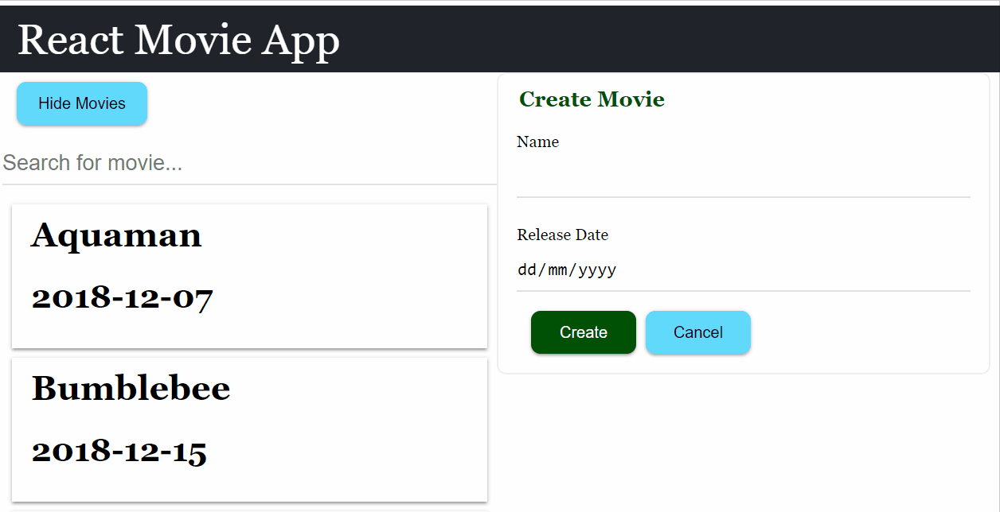

# Lifting State Up

Lifting state up is a common refactoring in React app. This section will discuss when you need to do that and how to do that.

## Allow user to Edit Movie

Currently our app only allow us to create movie, but it would be better if our app allows us to edit the existing movie too. Let's do that in this section.

### Prerequisite: API Service for Edit Movie

Similar to create movie, the prerequisite for our app to support edit movie is the backend service supports it.

Let's test the API with [Restlet Client][restlet-client] that we've installed in previous section:

1. select "PUT" in the METHOD dropdown.
1. enter the following URL in the URL bar:
   ```
   https://react-intro-movies.herokuapp.com/movies/{movieId}
   ```
   - you need to replace `{movieId}` in the URL with the id of the movie that you want to update.
   - you can get the movie id by inspecting the payload of `https://react-intro-movies.herokuapp.com/movies` GET calls. For instance, id for "Aquaman" is 1, while id for "A Star Is Born" is 4.
1. add the following content in the BODY field (change it to the movie you want to update):
   ```json
   {
     "id": 4,
     "name": "A Star Is Born v2",
     "releaseDate": "2018-10-03"
   }
   ```
1. click send

Now when you load your app, you should be see your update is shown.

### Add Ajax Call Function to Make the PUT Request

Create a `saveMovie` function in `api.js`:

```js
export const saveMovie = movie =>
  axios
    .put(`https://react-intro-movies.herokuapp.com/movies/${movie.id}`, movie)
    .then(res => res.data);
```

Since there is some duplications of the URL, let's refactor them:

```js
import axios from 'axios';

const MOVIE_ENDPOINT = 'https://react-intro-movies.herokuapp.com/movies';

export const loadMovies = () => axios(MOVIE_ENDPOINT).then(res => res.data);

export const createMovie = movie =>
  axios.post(MOVIE_ENDPOINT, movie).then(res => res.data);

export const saveMovie = movie =>
  axios.put(`${MOVIE_ENDPOINT}/${movie.id}`, movie).then(res => res.data);
```

- similar to `axios.put`, the second parameter of `axios.put` is the data you want to submit.

### The Interaction of Edit Movie

Let's discuss how we want the edit movie interaction be like.

1. By default, the form will be used to create movie.
1. When user click on a movie on the movie list, the form will be populated with the details of the movie, and the form will be used to edit the movie.
1. User can click "Cancel" button to restore the form to become create movie form again.



### Implementation Overview of Edit Movie

Now that we understand the interaction, let's discuss how are we going to implements it before we write the code.

We need

1. a state to track if any movie is selected. If a movie selected, make the form as an edit form, else is a create form.
1. enhance `MovieForm` so it will display different text based on if movie is selected, e.g. submit button is labelled "Save" instead of "Create", the form title is "Edit Movie" instead of "Create Movie".
1. add a Reset button in `MovieForm` to make the unselect Movie and clear out all its current form value.
1. a way to update the form values when movie is selected, so that the values will be defaulted to the movie data.

Let's implements these.

### Add isEdit State

In the `App` component, let's add a `isEdit` state (which will be passed to `MovieForm` component) while `setIsEdit` will be passed to `Movie` component as `onClick` props:

```jsx
function App() {
  const [moviesShown, toggleShowMovies] = useToggle(false);
  const { movies, isLoading, loadMoviesData } = useMovieData();
  // highlight-start
  const [isEdit, setIsEdit] = React.useState(false);

  const resetForm = () => {
    setIsEdit(false);
  };
  // highlight-end

  return (
    <div>
      <TitleBar>
        <h1>React Movie App</h1>
      </TitleBar>
      <div className="container">
        <div>
          <div className="button-container">
            <Button onClick={toggleShowMovies}>
              {moviesShown ? 'Hide' : 'Show'} Movies
            </Button>
          </div>
          {moviesShown && (
            <BusyContainer isLoading={isLoading}>
              {movies.map(movie => (
                <Movie
                  name={movie.name}
                  releaseDate={movie.releaseDate}
                  {/* highlight-next-line */}
                  onClick={() => setIsEdit(true)}
                  key={movie.id}
                />
              ))}
            </BusyContainer>
          )}
        </div>
        <div>
          <MovieForm
            onSubmitSuccess={loadMoviesData}
            {/* highlight-start */}
            onReset={resetForm}
            isEdit={isEdit}
            {/* highlight-end */}
          />
        </div>
      </div>
    </div>
  );
}
```

Let's update `Movie` component to call the `onClick` props:

```jsx
export const Movie = props => (
  {/* highlight-next-line */}
  <div className="movie-container" onClick={props.onClick}>
    <h1>{props.name}</h1>
    <h2>{props.releaseDate}</h2>
  </div>
);
```

And update `MovieForm` component to show different text and ability to resetForm:

```jsx
import { Button } from './components/button'; // highlight-line

...

// highlight-next-line
export const MovieForm = ({ isEdit, onSubmitSuccess, resetForm }) => {
  const { values, setName, setReleaseDate } = useMovieFormData();

  const handleSubmit = ev => {
    ev.preventDefault();
    createMovie(values).then(() => {
      onSubmitSuccess();
      setName('');
      setReleaseDate('');
    });
  };

  return (
    <div className="movie-form">
      <form onSubmit={handleSubmit}>
        {/* highlight-next-line */}
        <legend>{isEdit ? 'Edit' : 'Create'} Movie</legend>
        <div className="field">
          <label htmlFor="name" className="label">
            Name
          </label>
          <input
            className="input"
            value={values.name}
            id="name"
            name="name"
            onChange={ev => setName(ev.target.value)}
            required
          />
        </div>
        <div className="field">
          <label htmlFor="releaseDate" className="label">
            Release Date
          </label>
          <input
            className="input"
            value={values.releaseDate}
            id="releaseDate"
            name="releaseDate"
            type="date"
            onChange={ev => setReleaseDate(ev.target.value)}
            required
          />
        </div>
        <div className="button-container">
          <button type="submit" className="submit-button">
            {/* highlight-next-line */}
            {isEdit ? 'Save' : 'Create'}
          </button>
          {/* highlight-next-line */}
          <Button onClick={resetForm}>Cancel</Button>
        </div>
      </form>
    </div>
  );
};
```

[restlet-client]: https://chrome.google.com/webstore/detail/restlet-client-rest-api-t/aejoelaoggembcahagimdiliamlcdmfm?hl=en
